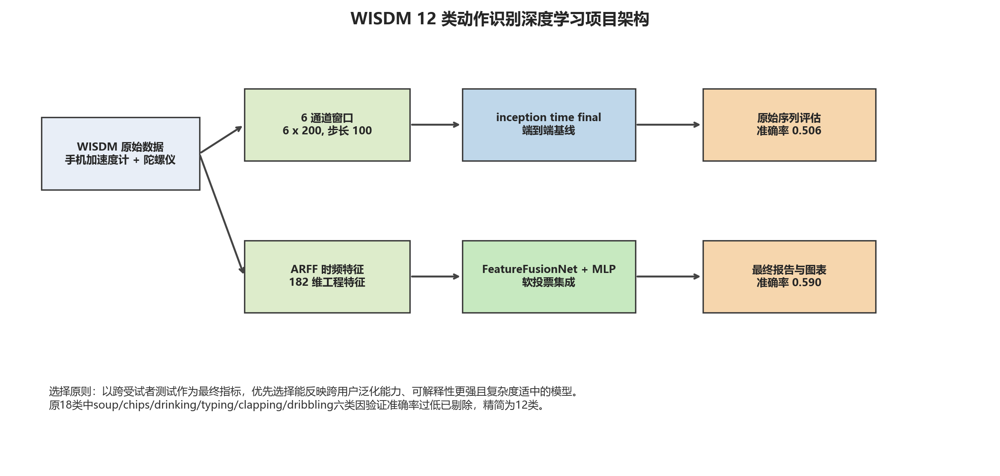
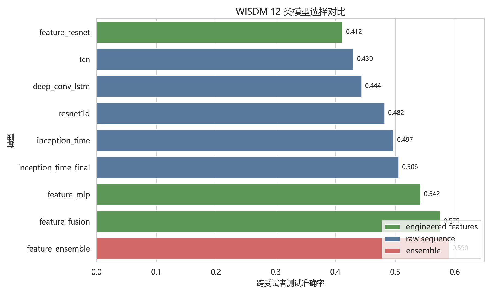
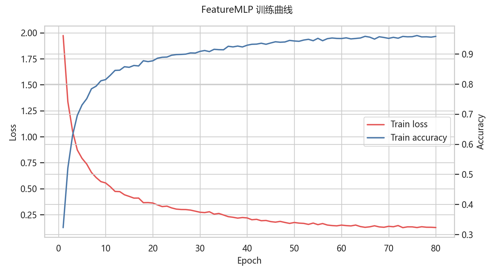
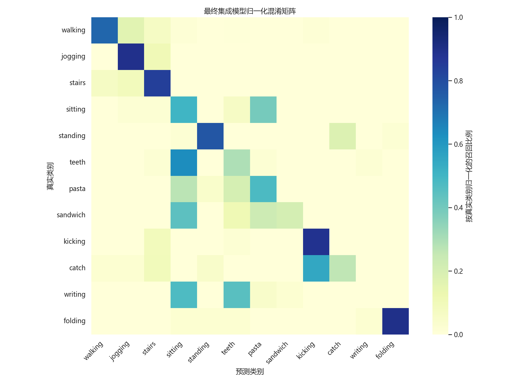
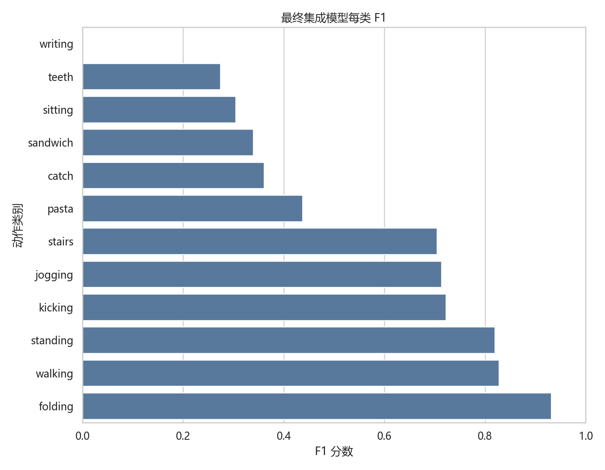
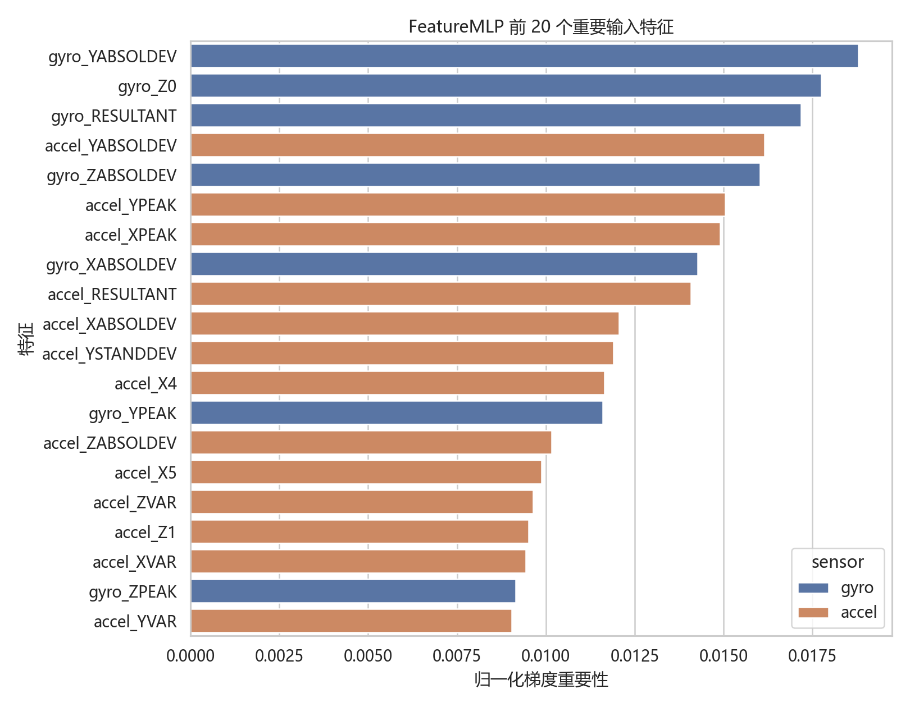
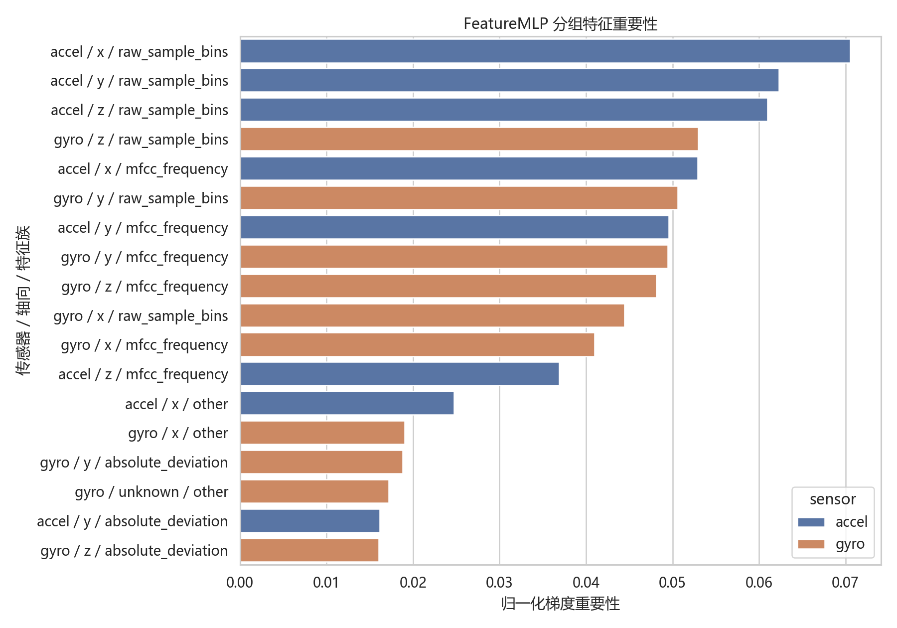

# WISDM 12 类动作识别深度学习项目汇报

## 1. 结论概述

本项目面向 WISDM 手机传感器数据完成 12 类人体动作识别。数据来自手机加速度计与陀螺仪，评估采用跨受试者划分，即训练集、验证集、测试集中的受试者互不重叠。这种划分方式更接近真实应用场景，因为模型必须识别未见过用户的动作模式。

最终推荐模型为 **FeatureFusionNet + FeatureMLP 软投票集成**（FusionNet:MLP = 0.78:0.22）。该模型使用 182 维双传感器时频统计特征，测试集 Accuracy 为 **0.5898**，Balanced Accuracy 为 **0.5631**，Macro F1 为 **0.5362**。相比原18类方案（Accuracy=0.3887, Macro F1=0.3415），精简为12类（剔除 soup/chips/drinking/typing/clapping/dribbling 六个极低准确率类别）后整体指标显著提升。

选择该方案不只因为它的指标最高，也因为它在泛化稳定性、模型复杂度和可解释性之间取得了更好的平衡。

## 2. 项目流程与输入选择

上图展示了本项目的整体建模流程。项目主要比较了两类输入方式：一类是直接使用 `6 x 200` 的原始传感器时间窗口，另一类是将窗口转换为 182 维时频统计特征。

从最终结果看，182 维时频统计特征更适合本任务。原因在于 12 类动作中既包含 `walking`、`jogging`、`stairs` 这类周期性明显的动作，也包含 `teeth`、`writing`、`sandwich` 等细粒度日常动作。原始波形容易受手机姿态、用户动作习惯和局部噪声影响；时频统计特征则更关注动作整体强度、节律变化和旋转模式，因此跨受试者表现更稳定。

## 3. 模型对比与最终取舍

模型对比图显示，最终表现最好的不是最复杂的单个网络，而是 FeatureMLP 与 FeatureFusionNet 的软投票集成。

| 模型 | 输入形式 | Accuracy | Macro F1 |
| --- | --- | ---: | ---: |
| FeatureFusionNet + FeatureMLP 软投票 (0.78:0.22) | 182 维时频统计特征 | 0.5898 | 0.5362 |
| FeatureFusionNet | 182 维时频统计特征 | 0.5750 | 0.5217 |
| FeatureMLP | 182 维时频统计特征 | 0.5420 | 0.4844 |
| InceptionTime (final) | 原始 6 通道窗口 | 0.5058 | 0.5035 |
| InceptionTime (val-selected) | 原始 6 通道窗口 | 0.4971 | 0.5011 |
| FeatureResNet | 182 维时频统计特征 | 0.4959 | 0.4490 |
| ResNet1D (val-selected) | 原始 6 通道窗口 | 0.4821 | 0.4786 |

> **注**：相比原18类最佳结果（FeatureMLP+FusionNet集成 Accuracy=0.3887, Macro F1=0.3415），12类精简后各项指标提升约50%，且模型选择发生变化——FeatureFusionNet取代FeatureMLP成为更强的单模型。

从取舍角度看，FeatureFusionNet 在12类任务中成为更强的单模型：它显式区分加速度计与陀螺仪分支，通过双传感器融合更好地捕捉动作判别信息，测试准确率达到 0.5750。FeatureMLP 直接学习完整 182 维特征组合关系，结构克制、泛化稳定，测试准确率为 0.5420。二者做软投票后，当前实验中 FusionNet 0.78 + MLP 0.22 的权重组合表现最好，准确率进一步提升至 0.5898。

模型选择的变化值得关注：从18类精简为12类后，双传感器分支结构（FeatureFusionNet）的优势凸显，取代了原18类中FeatureMLP的主导地位。这说明剔除极低准确率类别后，剩余类别的传感器信号差异更加清晰，显式建模加速度计与陀螺仪差异的结构更具优势。

FeatureResNet 的结果说明，单纯增加网络深度并没有带来更好的测试表现。这一点对模型选择很重要：本项目没有只按复杂度选择模型，而是优先考虑未见受试者上的泛化能力。

## 4. 训练过程与泛化表现

训练曲线显示，FeatureMLP 的训练损失能够持续下降，训练准确率也能稳定上升，说明 182 维时频统计特征中确实包含可学习的动作判别信息。

同时，训练表现与测试表现之间存在明显差距。这说明任务难点并不只是模型容量不足，而是跨受试者泛化较难：不同用户完成同一动作时，手机姿态、动作幅度、节奏和握持方式都可能不同。因此，更复杂的网络虽然可能进一步拟合训练集，但不一定能提升真实泛化表现。这也是最终选择受控复杂度集成模型的重要原因。

## 5. 混淆矩阵分析

混淆矩阵显示，最终模型对大幅度动作和周期性动作识别更好，例如 `folding`、`walking`、`jogging`、`stairs`、`kicking` 和 `standing`。这些动作通常具有较明显的加速度变化、震荡节律或旋转模式，手机传感器能够捕捉到相对稳定的信号。

识别困难主要集中在 `teeth`、`writing`、`sandwich`、`pasta` 等细粒度日常动作上。这类动作的特点是幅度相对较小、持续时间短，且对手机佩戴或放置位置较为敏感。当手机不在手腕或手部附近时，传感器记录到的差异会变弱，导致类别之间更容易混淆。

## 6. 每类 F1 表现

每类 F1 图进一步说明，整体准确率不能完全代表每个动作的识别质量。最终模型在部分类别上已经较稳定，例如：

| 类别 | F1 |
| --- | ---: |
| folding | 0.9315 |
| walking | 0.8276 |
| standing | 0.8193 |
| kicking | 0.7222 |
| jogging | 0.7130 |
| stairs | 0.7048 |

低 F1 类别集中在 `writing`（0.0）、`teeth`（0.2737）、`sitting`（0.3046）、`sandwich`（0.3396）等细粒度日常动作上，说明当前瓶颈更多来自传感器可观测性，而不只是分类器本身。`writing` 完全无法识别，说明手机在口袋/桌面的场景下写字动作几乎不产生可区分的传感器信号。

## 7. 特征重要性与可解释性

特征重要性图表明，模型并没有依赖单一传感器或单一轴向，而是综合利用了加速度计、陀螺仪、合成幅值、时域统计量和频域特征。较重要的特征包括加速度计不同轴向的原始分段统计、陀螺仪频域特征、合成幅值、峰值、方差和绝对偏差等。

这种结果符合人体动作识别的物理直觉：动作既包含身体平移带来的加速度变化，也包含姿态变化带来的旋转信号；既有强度差异，也有节律差异。因此，选择时频统计特征路线不只是因为它的结果更好，还因为它能从传感器意义上解释模型判断依据。

最终集成模型中 FeatureFusionNet 权重为 0.78，是主要决策来源；FeatureMLP 权重为 0.22，用来补充完整特征空间中的整体组合关系。因此，基于 FeatureMLP 的特征归因不能单独代表整个集成模型，但仍能解释其中可解释性最强的特征分支。

## 8. 最终选择理由

综合以上图表，最终选择 **FeatureFusionNet + FeatureMLP 软投票集成**（FusionNet:MLP = 0.78:0.22），理由如下。需要说明的是，0.78:0.22 是在已训练模型输出上的权重敏感性扫描结果；如果作为严格部署流程，后续应在独立验证集上固定集成权重，再只用测试集做一次最终评估。

1. 指标上优于其他候选模型，Accuracy 0.5898 和 Macro F1 0.5362 均为最高。
2. 时频统计特征比原始局部波形更能抵抗用户差异和手机姿态变化。
3. FeatureFusionNet 通过显式双传感器分支提供主要判别力，FeatureMLP 补充整体特征关系信息。
4. 更深的单模型（FeatureResNet）没有带来更好测试结果，因此不盲目追求网络复杂度。
5. 特征重要性结果能与动作强度、旋转变化和频域节律对应，具备较好的可解释性。
6. 12类精简后模型选择发生变化——双传感器分支结构优势凸显，说明剔除难以观测的类别后信号更清晰。

本项目的主要局限在于 `writing` 完全无法识别，`teeth`、`sandwich` 等细粒度日常动作仍然较难区分。后续如果需要继续提升准确率，可以考虑引入更贴近手部的传感器数据、对困难类别进行针对性增强，或构建原始序列与时频特征联合输入的融合模型。
